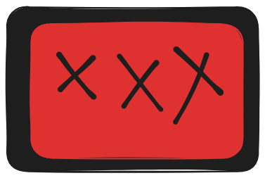

# Doxa Character Profiler

A visual character analysis tool for creating multi-dimensional personality profiles using interactive radar and scatter charts. Built with React, Recharts, and TailwindCSS.



## What It Does

Doxa Character Profiler lets you create, customize, and export visual personality charts. Each chart represents a "layer" of analysis (e.g., Big Five traits, cognitive functions, values) with customizable fields and values. The tool supports:

- **Radar Charts** (3+ traits) - Multi-dimensional personality visualization
- **2D Scatter Charts** (2 traits) - X-Y relationship mapping
- **PNG Export** - High-quality image export for sharing
- **Drag & Drop** - Reorder charts and traits intuitively
- **Inline Editing** - Click any label to edit directly on the canvas
- **Asymmetric Parallax Scrolling** - Smooth linked scrolling between panels

## The Vibe Coding Journey

This application was built through collaborative "vibe coding" - a conversational development process between a human and AI assistant. Here's how it evolved:

1. **Foundation** - Started with a basic React + Vite template, added Recharts for visualization
2. **Core Features** - Implemented chart context, radar charts, trait management with sliders
3. **2D Charts** - Added scatter plot support when charts have exactly 2 fields
4. **Drag & Drop** - Enabled reordering of both charts and individual traits with custom drag previews
5. **Inline Editing** - Made chart titles and field names editable by clicking directly on the visualization
6. **UI Polish** - Added animations, hover effects, color customization, and consistent styling
7. **Export** - Integrated html-to-image for PNG screenshot export
8. **Asymmetric Scrolling** - Implemented proportional parallax scrolling between Control and View panels
9. **Optimization** - Added memoization, CSS containment, GPU acceleration, and lerp-based smooth scrolling

The entire development was iterative - features were requested, implemented, refined based on feedback, and optimized for performance.

## Project Structure

```
character-profiler/
├── src/
│   ├── components/
│   │   ├── ChartDisplay.jsx    # Individual chart rendering (Radar/Scatter)
│   │   ├── ControlPanel.jsx    # Left panel with chart controls
│   │   └── VisualizationCanvas.jsx  # Right panel chart grid
│   ├── context/
│   │   └── ChartContext.jsx    # Global state management for charts
│   ├── App.jsx                 # Main layout, scroll sync, export logic
│   ├── index.css               # Global styles, animations, optimizations
│   └── main.jsx                # React entry point
├── public/
│   └── logo.png                # Doxa branding
├── SCANME.md                   # Instructions for AI assistants
└── README.md                   # This file
```

## Tech Stack

- **React 19** - UI framework with hooks
- **Vite** - Build tool and dev server
- **Recharts** - Chart library (RadarChart, ScatterChart)
- **TailwindCSS** - Utility-first styling
- **Lucide React** - Icon library
- **html-to-image** - PNG export functionality

## Getting Started

```bash
# Install dependencies
npm install

# Start development server
npm run dev

# Build for production
npm run build
```

## Usage

1. **Add Charts** - Click "Add New Chart" at the bottom of the Control Panel
2. **Customize** - Change colors, add/remove traits, adjust values with sliders
3. **Reorder** - Drag charts or traits to rearrange
4. **Edit Labels** - Click any chart title or axis label to rename
5. **Export** - Click "Export" to download as PNG

## License

MIT
